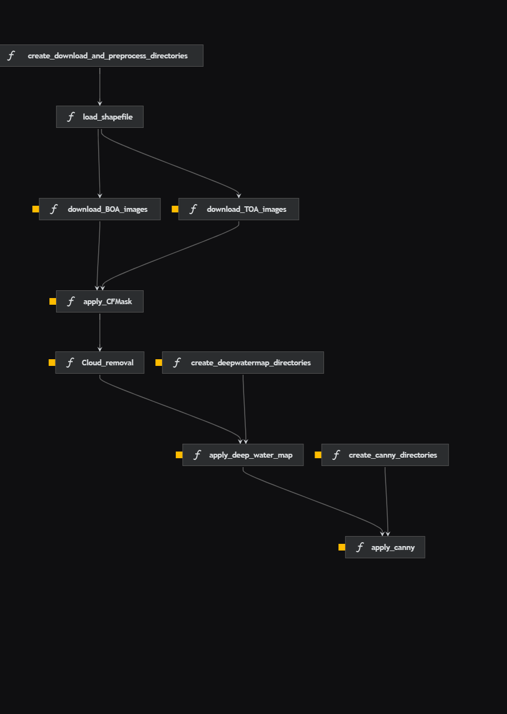

# Remote Sensing Preprocessing Pipeline

[](https://kedro.org)

## Overview

This project is group of  data preprocessing pipelines to process Sentinel 2, Landsat 5 TM, Landsat 7 ETM+, Landsat 8 OLI/TIRS and Landsat 9 OLI-2/TIRS-2, which was generated using `kedro 0.19.10`. The preprocess includes Cloud and Cloud shadow remove and replacement, water detect, etc.

### Example




Take a look at the [Kedro documentation](https://docs.kedro.org) to get started.

## Install Visual Studio Code

- [Visual Studio Code Tutorial](https://youtu.be/R9dLGLVqK9Q?si=G_Fb6qW_f7c9BY5p)

## Install Python 3.11

It's required by some dependecies runs on python 3.11

- [Python 3.11 Donwload](https://www.python.org/downloads/release/python-31111/)

## How To create a virtual environment 

- [ Virtual environment's python on windows (using venv and VSCode) - Portuguese video ](https://youtu.be/m1TYpvIYm74?si=m6XuErnnPiZRgCuR)


## How to install dependencies

Declare any dependencies in `requirements.txt` or `requirements_win.txt` if on windows, for `pip` installation.

To install them, run:

```
On Linux
$ pip install -r requirements.txt
```

```
On Windows
$ pip install -r requirements_win.txt
```

`$ pip install -r file.txt` install all lib listed in file.txt


## Donwload ML/DL model's weigths

If You desire run with ML/DL models, you need to download the weigths:

### Deep Water Map Wheigths

You must donwload and unzip the `checkpoints` folder inside `src\utils\deepwatermap`

- [Checkpoints Download](https://utexas.app.box.com/s/j9ymvdkaq36tk04be680mbmlaju08zkq/file/565662752887)


## How to run your Kedro pipeline

You can run your Kedro project with:

```
# Running default pipeline
$ kedro run
```

```
# Running specific pipeline
$ kedon run --pipeline=my_pipeline
```

## Parameters .yml files

## Data folders structure